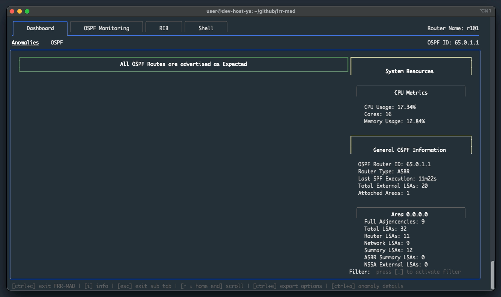
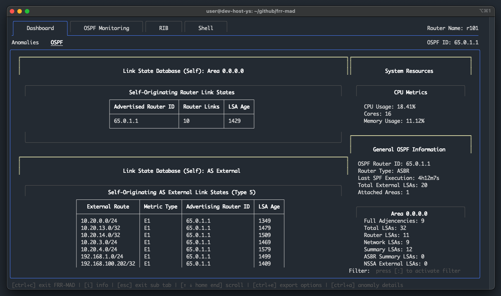
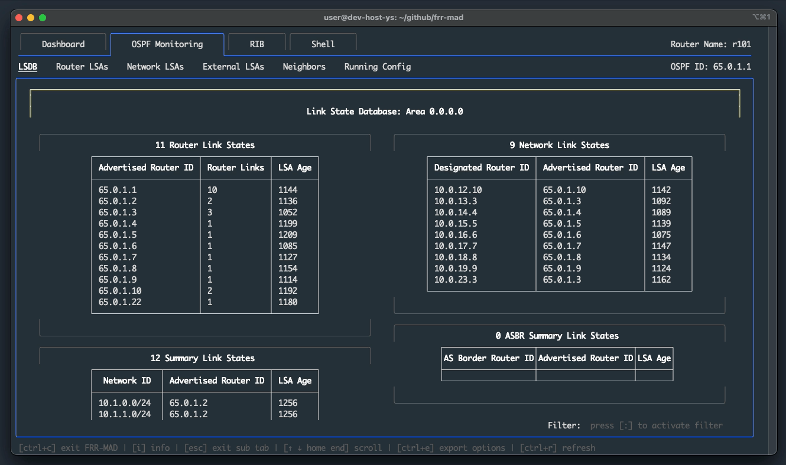
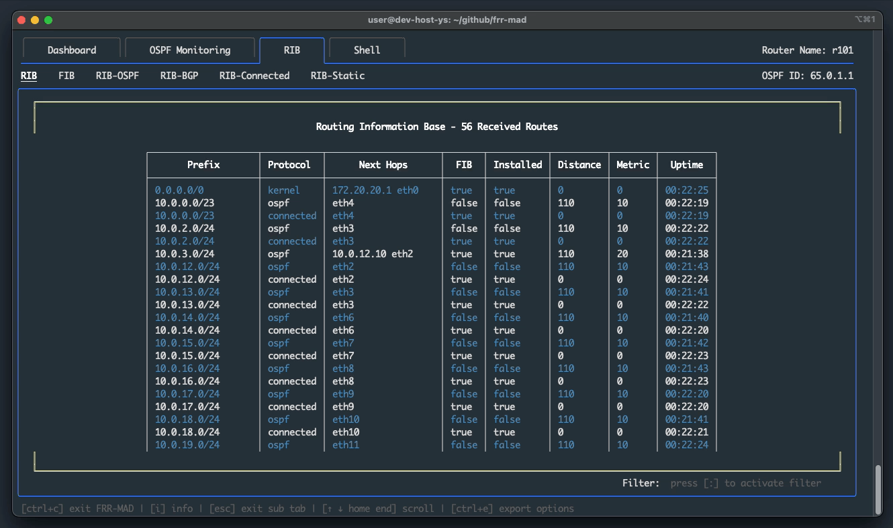
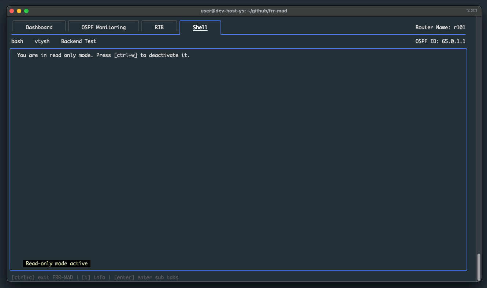
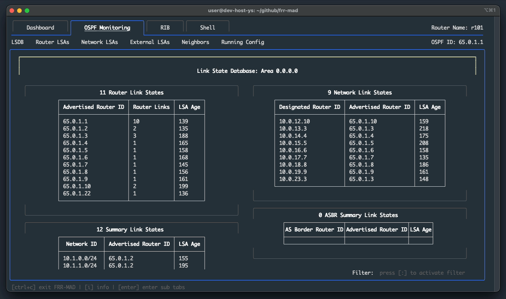

# FRR-MAD Demo

## Dashboard

|        |
|:----------------------------------------:|
| How anomalies are shown on the Dashboard |

|      |
|:-----------------------------------------------------------:|
| OSPF dashboard, showing self-originating LSAs and Summaries |

## OSPF Monitor

|  |
|:-----------------------------------------------------:|
|           Monitoring Capabilities for OSPF            |

## RIB and FIB Monitor

|  |
|:-------------------------------------------------------:|
|   RIB and FIB tables, plus predefined filtered RIB tables    |

## Custom Shell

|                    |
|:---------------------------------------------------------:|
| Write-Mode activation and vtysh command execution |

## Filter Option

|  |
|:---------------------------------------:|
|       Filter activation and usage       |

